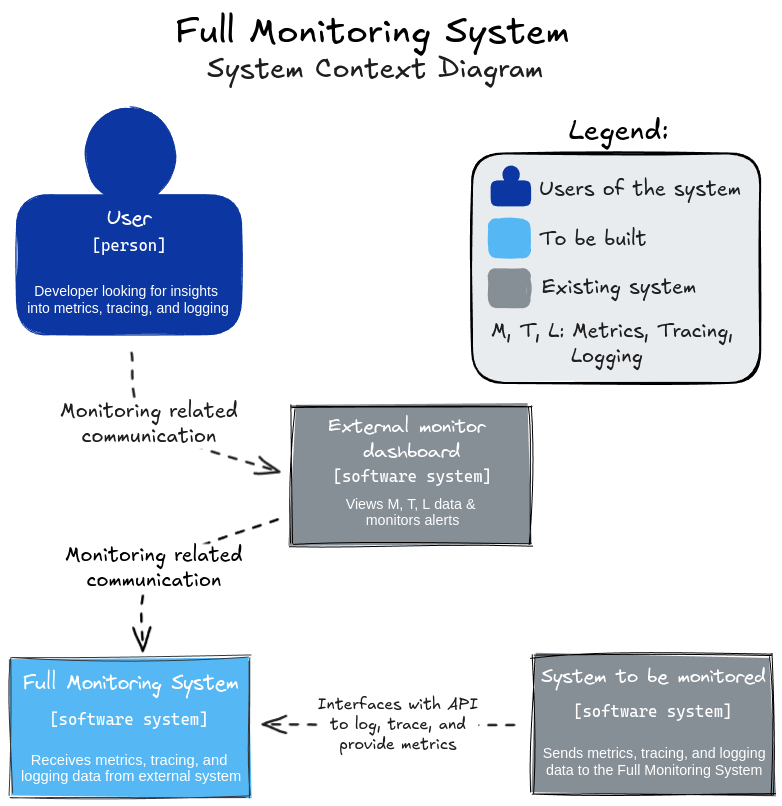
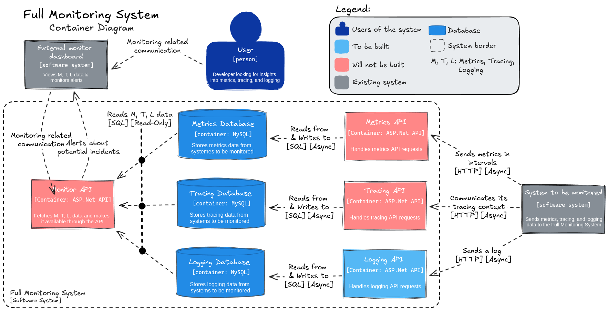
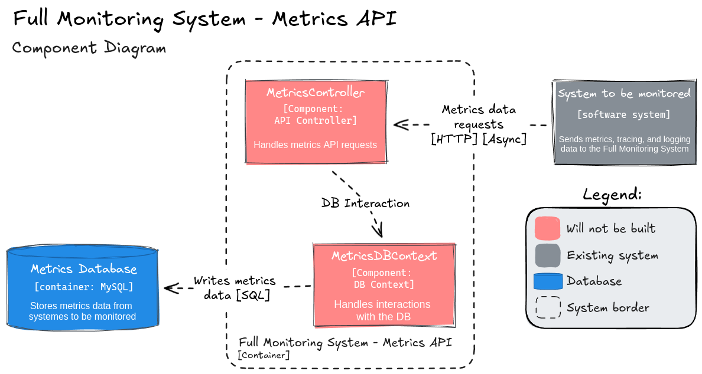
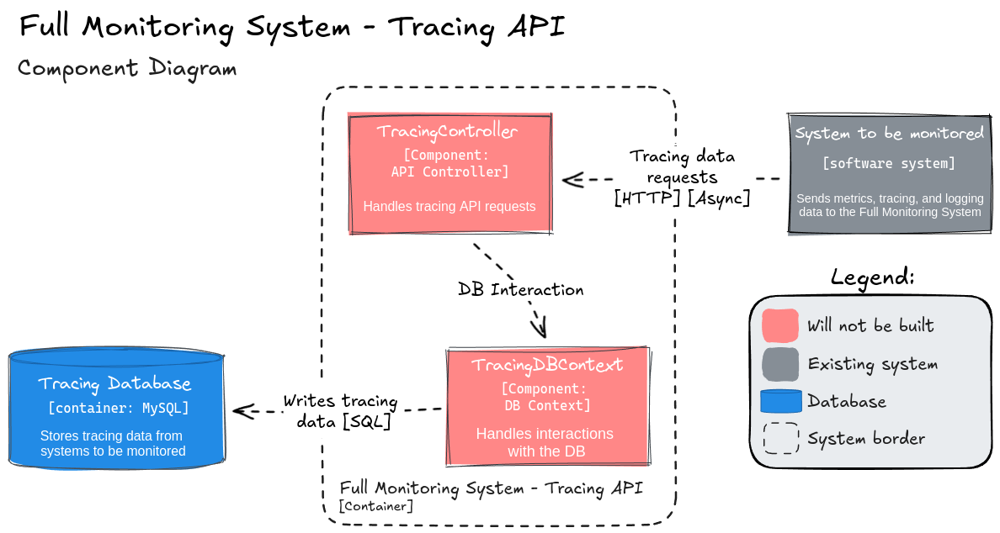
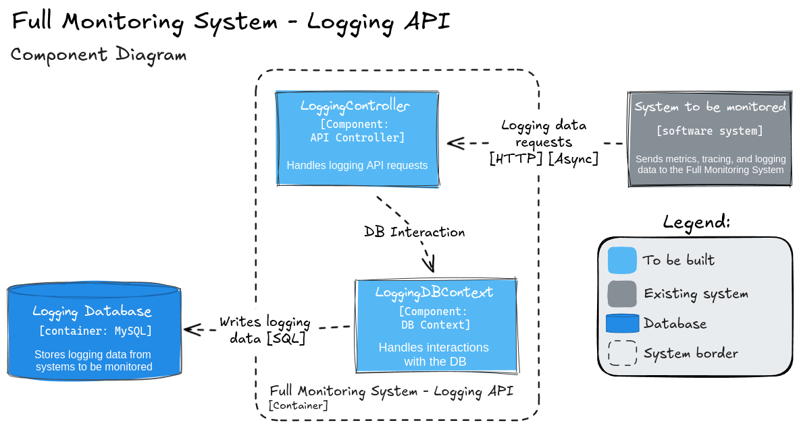
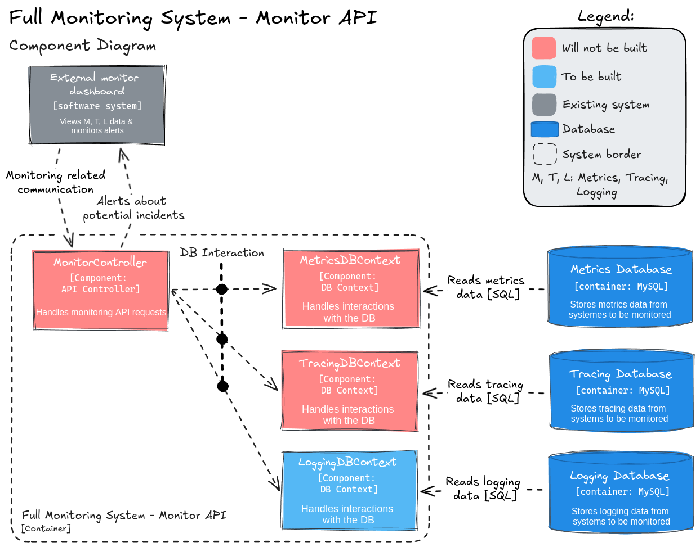

# Full Monitoring System Design + API Container & DB docker-compose
This is a compulsory assignment for Development of Large Systems Week 39+40.  

`In this compulsory assignment you must design a full monitoring system using the C4-modelling framework described in the prepare section of these weeks.
Furthermore you must also code one of the API-containers from the level 2 diagram that uses a database.`

The C4 Model is to be used to design a monitoring system for external systems, such that metrics, tracing, and logging can be provided as a service.

# Usage
Run `docker-compose up`, and use Postman, or another HTTP client to run the following requests:  

## PostLog | POST
Posts a log to the Logging API.  
`http://localhost:3001/api/Logging/PostLog` using request body:
```json
{
    "message": "FATAL! SELF DESTRUCTION IMMINENT",
    "severity": 5
}
```

## GetExample | GET
Gets an example of a log, for easy formatting assimilation.  
`http://localhost:3001/api/Logging/GetExample`  

## GetLogs | GET
Gets all logs from the database.  
`http://localhost:3001/api/Logging/GetLogs`  

# Diagrams
Below are the C4 diagrams, outlining the design of the system.  
No level 4 diagrams have been made.

<p align="center">
  
</p>
<p align="center">
  
</p>
<p align="center">
  
</p>
<p align="center">
  
</p>
<p align="center">
  
</p>
<p align="center">
  
</p>
